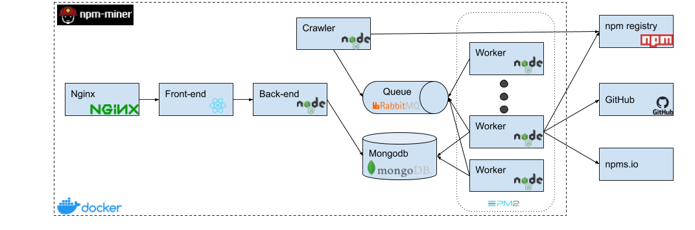

# npm-miner

Static code analysis of the npm registry.

The `docker-compose.yml` contains the services needed by the npm-miner to work. These are:
- nginx for a web server
- rabbitmq for a worker queue
- mongodb and mongo-express for the database and a web client for it

The developed services include:
- the front-end in react
- the back-end in node
- the workers in node:
    - the crawler
    - the analyzers

The workers above are handled with `pm2` module.

## Architecture and data-flow



Front-facing there is Nginx that handles the web traffic and serves the React.js built Single Page Application (SPA). The SPA sends REST API requests to the node.js-express back-end server. The back-end server on its turn queries the MongoDB for the requested data and sends them back to the front-end for viewing.

On the mining side, the Crawler through a cron job, every ten minutes requests a random page of 100 packages from the CouchDB of the npm-registry. Immediatelly it sends 100 messages with the package.json files of the packages to the RabbitMQ to be consumed by the workers. The workers request metadata from GitHub and the analysis of npms.io and then download the tarball from the link provided in the latest package.json file and perform the static code analysis, storing the results in the MongoDB.

## Deploy

### Local for development

Make sure: `back-end/.env`, `front-end/.env` are set

The application runs in three shells:
1. Run: `docker-compose --file docker-compose-dev.yml up --force-recreate`
2. `cd back-end && npm run dev`
3. `cd front-end && npm start`

Check `localhost:3000`

### Test Locally the Docker compose deployment

Make sure: `.env` is set in the root folder of the project and run

```
docker-compose -f docker-compose-stage.yml up --build --force-recreate
```

Check `localhost:8080`

### Production Deployment

In the production server, pull the latest code and run:

```
docker-compose up --build -d
```

Check `npm-miner.com`

## Mongo dump and restore

In production:

1. `docker exec npm-miner-mongo mongodump --uri="mongodb://<username>:<password>@mongodb:27017/npmminer?authSource=admin" --collection=packages`
2. `docker exec -it ac00db5fb263 bash` and tar the `dump` dir (`tar -cf dump.tar dump/`)
3. `docker cp ac00db5fb263:/dump.tar .`
4. `docker exec -it ac00db5fb263 bash` and delete the tarfile and the `dump` dir

then `scp` in development

In development:

1. `docker cp dump.tar  npm-miner_mongo_1:/tmp/`
2. `docker exec -it npm-miner_mongo_1 bash` and untar (`tar -xvf /tmp/dump.tar`)
3. `docker exec npm-miner_mongo_1 mongorestore /dump --uri="mongodb://<username>:<password>@localhost:27017/npmminer?authSource=admin"`
4. Delete the `dump` directory and the tar file
